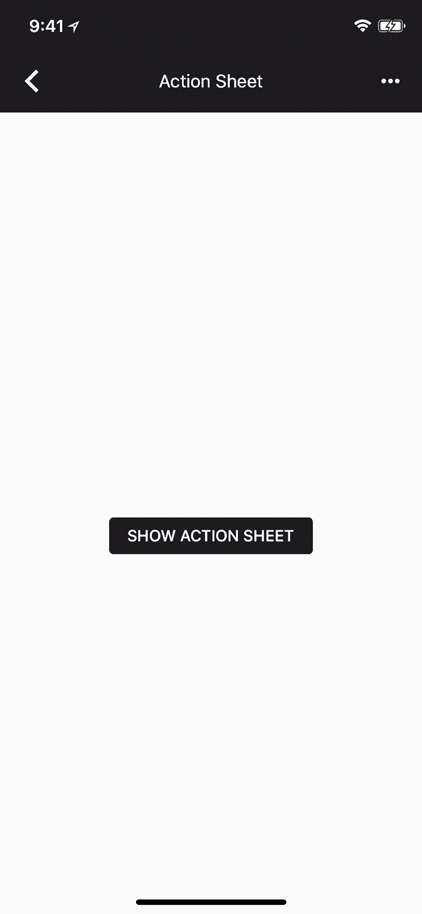

# Actionsheet 
Use an action sheet when you want the user to make a choice between two or more options, in response to their own action.

## User Stories
- As a developer, I want the user has the ability interact with the system in more than one way.
- As a developer, I want that on a user action, he has a more user friendly way when we have more than 1 action that can be performed.

## Implementation details
- On android, builds on a dismissable Bottomsheet to displayed action options for selection.
- On iOS, creates an actionsheet similar to the screenshot attached.
- On the web, displays a popover dropdown.

## Difference
- For android, the screenshot displays a Material 2 style BottomSheet, however; Material 3 style action sheet is more appropriate to implement for Molecules. Overall, the design choices implemented should be that of Material 3
- For iOS, irrespective of what the explanation video says, the actionsheet could also be displayed in the Bottomsheet similar to Apple does it in the Photos app.

## Reference
- [Explanation Video]([https://www.loom.com/share/eb137e8c5ebd45c4a5fc474a81a30f39])
- [Material 3: Bottomsheet](https://m3.material.io/components/bottom-sheets/overview)
- [Material 3: Menu Guidelines](https://m3.material.io/components/menus/guidelines)
- [React Native: ActionSheet](https://github.com/expo/react-native-action-sheet)
- [iOS Bottomsheet: Reference](https://sarunw.com/posts/bottom-sheet-in-ios-15-with-uisheetpresentationcontroller/)

## Screenshots

