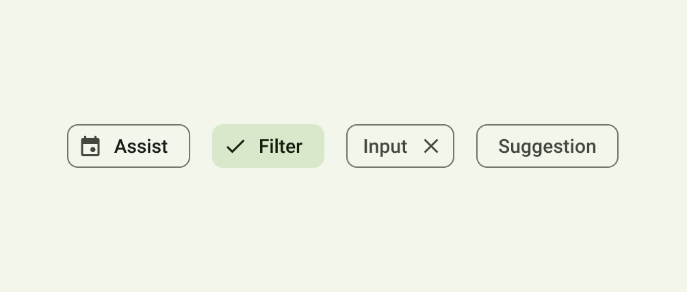

# Chips

-   As a user, I want to be able to click on a chip.
-   As a developer, I want the ability to display an optional remove button.
-   As a developer, I want to add icons on either side of the chip label. [See Implementation Details [1.](#implementation-details)]
-   As a user, I want to see long texts to be truncated labels with tooltips.
-   As a developer, I want to have predefined styled inputs with different variant options matching with specific platforms ios/android

## Variants

1. Outlined
2. Ghost
3. Solid

## Implementation Details

1. Implements [WithElements Interface](../interfaces/WithElementsInterface.md)

## References

-   [Material 3 Chips](https://m3.material.io/components/chips/overview)

## Screenshots

#### M3: Types of chips updated to assist, filter, input, and suggestion chips.

# Chips List

-   As a developer, I want to be able to display a scrollable list of chips.
-   As a developer, I want the ability show chips of mixed variants in the list.
-   As a user, I want to see navigation buttons for horizontal list when the list is scrollable.
