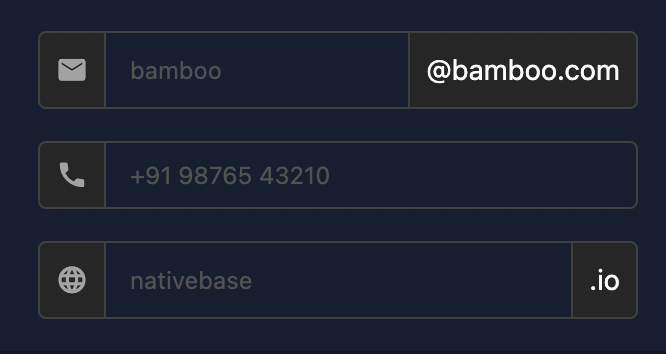

#WithElements
- As a developer, I want the ability to add elements before or after my wrapped element.
- As a developer, I want to be able to any sort of elements before or after the wrapped component.
- As a developer, I want to be able to pass down the components using props like `beforeElement` and `afterElement`.

## Screenshots
#### Left and right addons with inputs

## References
- [Native Base Input Elements](https://docs.nativebase.io/next/input#h3-input-elements)

## Usage in
- [Input](../Input.md)
- [Button](../Button.md)
- [Select](../Select.md)
- [FilePicker](../FilePicker.md)
- [Date Picker](../DatePicker.md)
- [Time Picker](../TimePicker.md)
- [Date Time Picker](../DateTimePicker.md)
- [Range Picker](../RangePicker.md)
- Textarea
