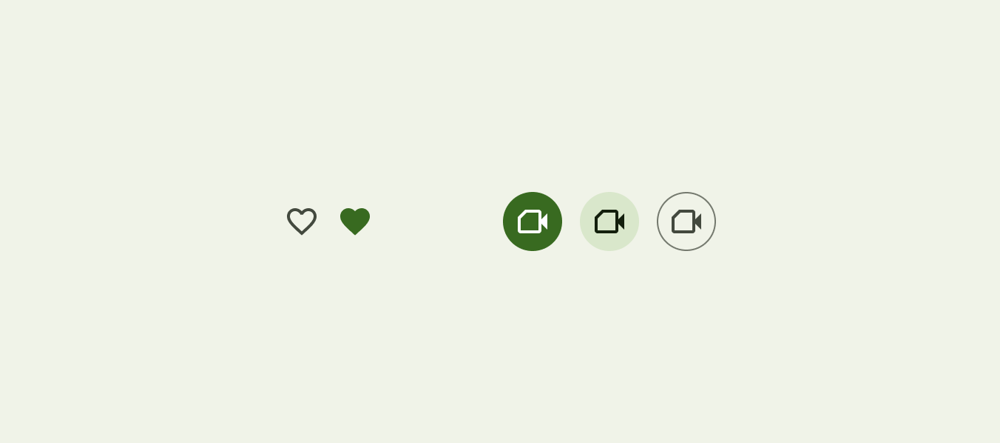

# Button
- As a developer, I want to inject the Button (React-native replacement) component and implement it as a button with only one Icon.
- As a user, I want to see feedback from button on hover and focus.
- As a user, I want to know that the button is disabled.

## Implementation Details
- Implements [WithRipple HOC](./HOC/WithRipple.md)

## References
- [Material 3 Figma Design](https://www.figma.com/file/hGlWM0wnP1UN5VtPGiaOJ2/Material-3-Design-Kit-(Community)?node-id=50716%3A11360)
- [Material 3 Design Guidelines](https://m3.material.io/components/icon-buttons/overview)

## Screenshots
#### Material 3 Button
