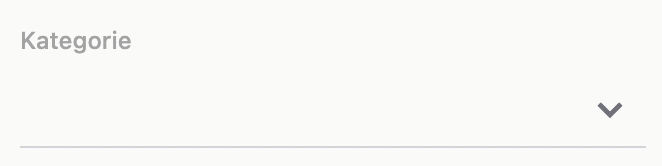
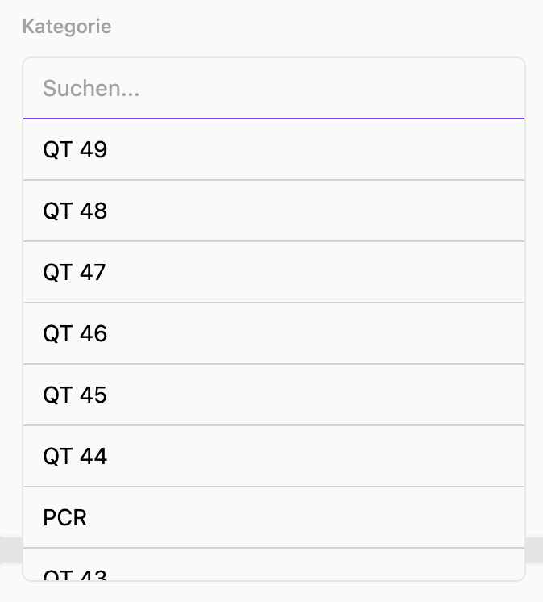
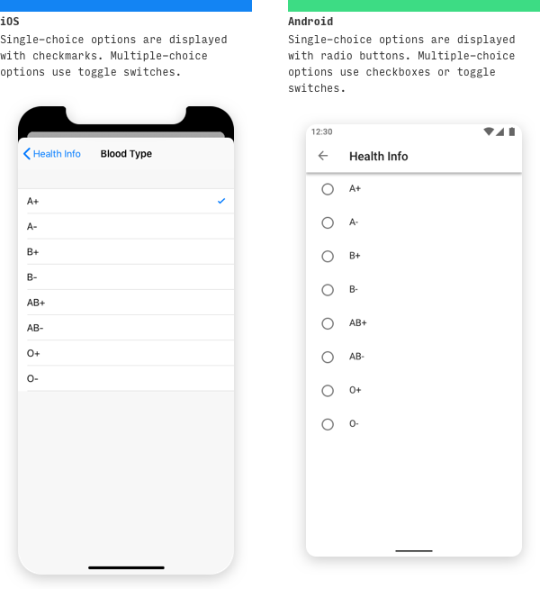
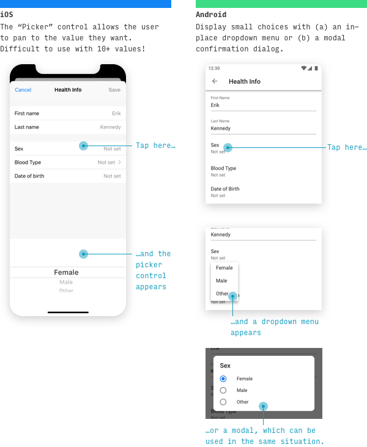

# Selects
- As a developer, I want to show a list of options for user input.
- As a developer, I want the to consume `useDataSource` to manage the records.
- As a developer, I want to be able to allow selection of multiple options with `multiple` boolean prop.
- As a developer, I want to control how the selection(s) are rendered. [see Rendering selections](#implementation-details)]
- As a developer, I want to control how my options are rendered [see Rendering options](#implementation-details)]
- As a developer, I want the ability to render grouped and/or flattened list of options (opt-groups with options or just options)
- As a developer, I want to have elements on left and/or right of the input; Icons or other types of user inputs/checkbox/select/button
- As a developer, I want to configurable caret/chevron-down icon next to the select field.
- As a user, I want to see feedback from inputs on hover and focus.
- As a user, I want to know that the field is disabled.
- As a user, I want to see a performant scrollable list of options as:
    * on desktop; popovers dropdowns for options.
    * on mobile/tab; if less than less than 5 options are available, display in bottom and centered action-sheets on mobile and tablet platforms when options count <= 5
    * on mobile/tab; else display a scrollable list in modal with a back button.\
    **Reference:** https://www.learnui.design/blog/ios-vs-android-app-ui-design-complete-guide.html#selection
- As a developer, I want to mark a field as required.
- As a user, I want to be notified that a field is required field.
- As a developer, I want to have predefined styled inputs with different variant options matching with specific platforms ios/android
- As a user, I want to see know when there are no options to be displayed.

## Explanation
[Video explaining Select Component in Bamboo Molecules](https://loom.com/share/4aa07b34c5464c7a9c9c317d995f0721)

## Screenshots
#### Select in Desktop without a value selected

#### Select in Desktop is lazy loading

#### Select in Desktop with the options loaded

#### Select in mobile Modal View

#### Select in mobile IOS and Android

## Searchable Dropdown
- As a developer, I want to be able to see a filter
- As a user, I want to see a field to filter my options.
- As a user, in case of a remote datasource I want that the options are auto-populated when I focus on the field.
- As a user, I want to see a spinner, when the options are loading.

## Implementation Details
- Render selections/options - Make use of Pure Function or Injected Components; use one of the approaches not both.
- Make a clean abstraction for logical and presentation components.
- Use the logical abstraction layer to build
    - [Checkbox Group](./Checkbox.md#checkbox-group)
    - [Radio Group](./Radio.md#radio-group)
    - Maybe also [Chips List](./Chips.md#chips-list)

## Variants
1. Outlined
2. Ghost
3. Underlined

## Components Consumed
- [Input](./Input.md)
- [IconButton](./IconButton.md)
- [Flat List](./FlatList.md)
- [Popover](./Popovers.md)
- [Dialog](./Dialog.md)
- [Actionsheet](./Actionsheet.md)
